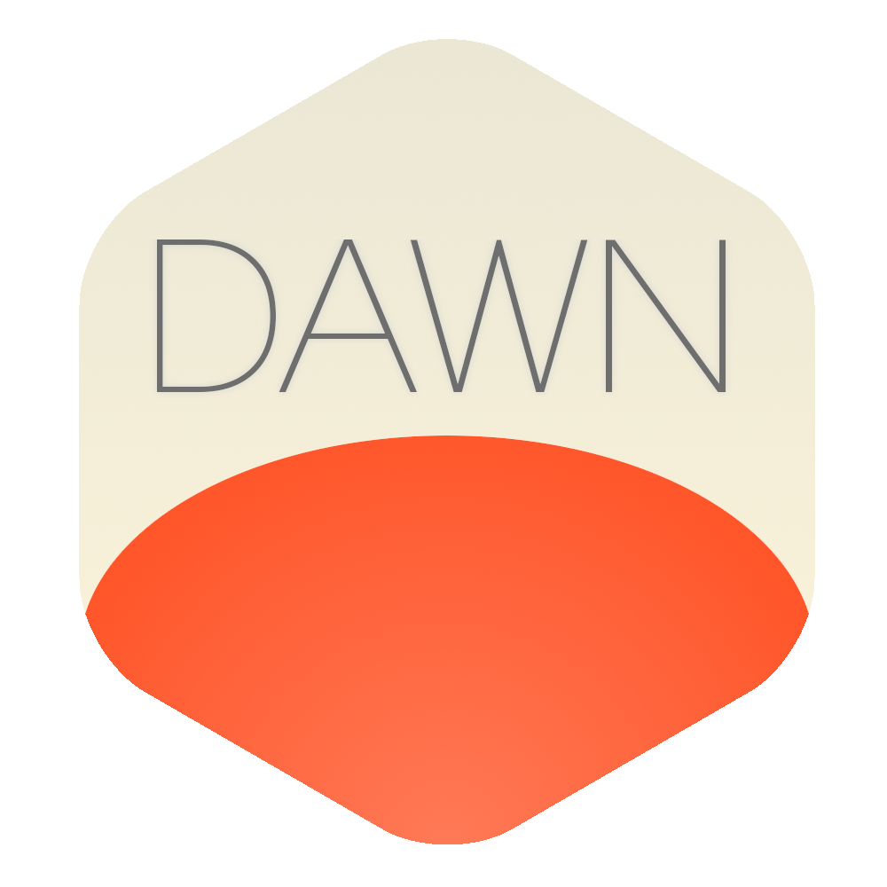

Dawn is a set of tools and configuration to help you bootstrap and maintain
a Docker-based PaaS. On top of configuring Docker Swarm, Dawn also 
configures and maintain the systems required for traffic routing, service
discovery, logging, monitoring and storage.

Requirements
------------

Coming soon.

|  Software  | Version |
|------------|---------|
| Ansible    | 2.2+    |

Quick Start
-----------

```bash
# coming soon
```

For a more elaborate walkthrough video, see [this tutorial](link-to-asciivideo).
You can also find the [documentation here](./docs-coming-soon).

What does it include?
---------------------

|  System                 | Software            | 
|-------------------------|---------------------|
| Container execution     | [Docker Swarm](https://www.docker.com/products/docker-swarm)    | 
| Traffic routing         | [Traefik](https://traefik.io/)         | 
| Service discovery       | [Consul](https://www.consul.io/)          | 
| Logging                 | [Kibana](https://www.elastic.co/products/kibana)          | 
| Metrics                 | [Grafana](https://grafana.net/)         | 
| Storage                 | [Ceph](https://ceph.com/)            | 

We also install additional subsystems which will sit behind each components above; 
for instance, logs are collected using [FluentD](http://www.fluentd.org/) 
and are sent to [ElasticSearch](https://www.elastic.co/products/elasticsearch), 
while metrics are collected with [Telegraf](https://github.com/influxdata/telegraf) 
before being sent to [Prometheus](https://prometheus.io/).

For a more detailed view of what software Dawn will install for you, please
see the [ansible folder](./ansible). 

Contributors
------------

Before contributing, please make sure to get familiar with [this document](./CONTRIBUTING.md)

All new contributors are welcome.

Credits
-------

### Logo

Nature graphic by <a href="http://www.flaticon.com/authors/freepik">Freepik</a>
from <a href="http://www.flaticon.com/">Flaticon</a> is licensed under
<a href="http://creativecommons.org/licenses/by/3.0/" title="Creative Commons BY 3.0">CC BY 3.0</a>.
Made with <a href="http://logomakr.com" title="Logo Maker">Logo Maker</a>

License
-------

Private.

Copyrights
----------

@wizcorp 2017 - All rights reserved
